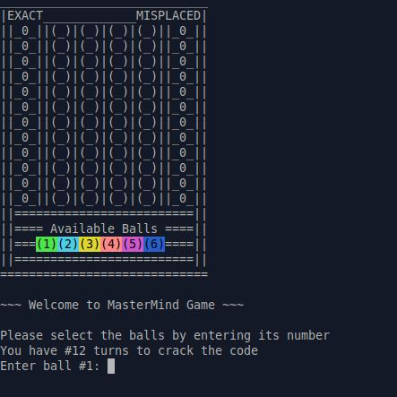

# 🎯 Mastermind Game (Terminal Version)

A simple Ruby implementation of the classic **Mastermind** game, played in the terminal.  
Built to practice Ruby basics like **classes**, **loops**, and **hashes** — with a touch of color!

---

## 🕹️ How to Play
- You have 12 attempts to guess a secret 4-color code.
- Pick 4 balls (numbers 1–6), each mapped to a colored circle.
- After each guess:
  - 🎯 Exact: right color, right spot.
  - 🔄 Misplaced: right color, wrong spot.

---

## 💎 Setup

Install the `colorize` gem if you don't have it yet:

## 📸 Screenshots

**Game in progress:**

**Game over screen:**

